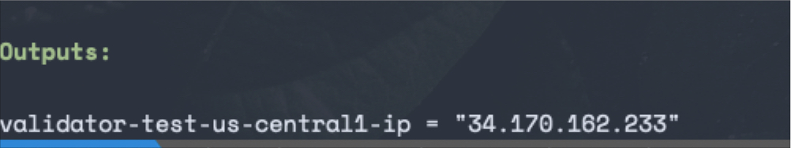

# Imperator terraform modules

This repository contains all the IaC code for Imperator infrastructure in all supported provides

# Why Terraform for IaC
Terraform is a popular Infrastructure as Code (IaC) tool used for provisioning and managing infrastructure in a variety of environments, including **on-premises data centers**, **public clouds**, and **hybrid environments**.

Terraform is suit for our projects because:
- Supports wide range of providers (AWS, GCP, etc.)
- Standard procedures for all providers (HCL, syntax)
- Declerative: Define what we expected and Terraform figure out the necessary steps to achieve that state.
- A mature tool, strong community

# Folder structure
```bash
├── README.md
├── modules					# Contains all modules
│   ├── aws					# AWS modules 
│   ├── do					# Digital Ocean modules
│   └── gcp					# GCP modules
│       ├── compute				# GCP: compute modules (GCE, GKE, etc.)
│       │   ├── outputs.tf
│       │   ├── validator.tf
│       │   └── variables.tf
│       └── network				# GCP: network modules (VPC, Firewall, etc.)
│           ├── firewall.tf
│           ├── main.tf
│           ├── outputs.tf
│           └── variables.tf
└── prod					# Environment: Production
    ├── aws-accountid				# Folder naming: {provider}-{accountid|identifier}
    ├── do-accountid
    └── gcp-accountid
        ├── main.tf				# main.tf: Import all modules. (Remote modules, local modules)
        ├── outputs.tf
        ├── provider.tf
        ├── terraform.tfstate
        └── terraform.tfstate.backup
```

## Folder: modules
This modules folder contains all the sub terraform modules that we need for the entire infrastructure.

The rule is simple:
- [PROVIDER NAME]: the provider you are using. It could be `gcp`, `aws`, `digital ocean` and many mores. Find the support providers at [Terraform Providers](https://registry.terraform.io/browse/providers)
- [PROVIDER NAME]/[MODULE NAME]: the congress modules we need for that provide. It usually contains network, compute and identity.

## Folder: [env]
This folder named as the target environment we are going to deploy. In this demo repository, we use `prod` which stands for production.

To the target provider-account, we named the folder as `[PROVIDER]-[ACCOUNTID|IDENTIFIER]`. This will help us quickly identify which account and provider we are going to deploy resources to.

## Terraform modules
I follow the practicle folder structure:
- `outputs.tf`: Expose outputs from the module so it can be reused by others
- `variables.tf`: Contains all the input variables for the modules
- other tf files will be named as the resources it is going to provision

# Setup

## Prerequisite
- terraform >= 1.3
- provider credentials with sufficient permissions
- ssh key to access validator node

## Detail steps
```bash
# Step 1. Git clone iac repo
git clone [iac-repo]

# Step 2. Setup provider credentials
# Depends the authentication of the target provider
# Perfer: export env so we don't need to hard code the value

# Step 3. If the provider-account does not exist, create a new one.
# For example: We want to deploy resoures to gcp and the account id is 123573
cd prod
mkdir gcp-123573
cp -r gcp-acccountid/* gcp-123573/
cp gcp-123573

# Step 4. Update provider.tf
# Update project_name to your google project 

# Step 5. Update main.tf
# Base on the description of variables, update its to the expected value

# Step 6. Setup remote state
# TODO: for this purpose of demo, I use local storage as the storage engine for state files
# It should be changed in the production env

# Step 7. Init terraform project
terraform init

# Step 8. Plan to see the resources changes
terraform plan

# Step 9. Apply the changes and type yes to rollout the changes to the real account
terraform apply 
```

After deploying the changes to infrastructure, you will the final output, which shows the IP of the validator node. Keep that for Ansible 
